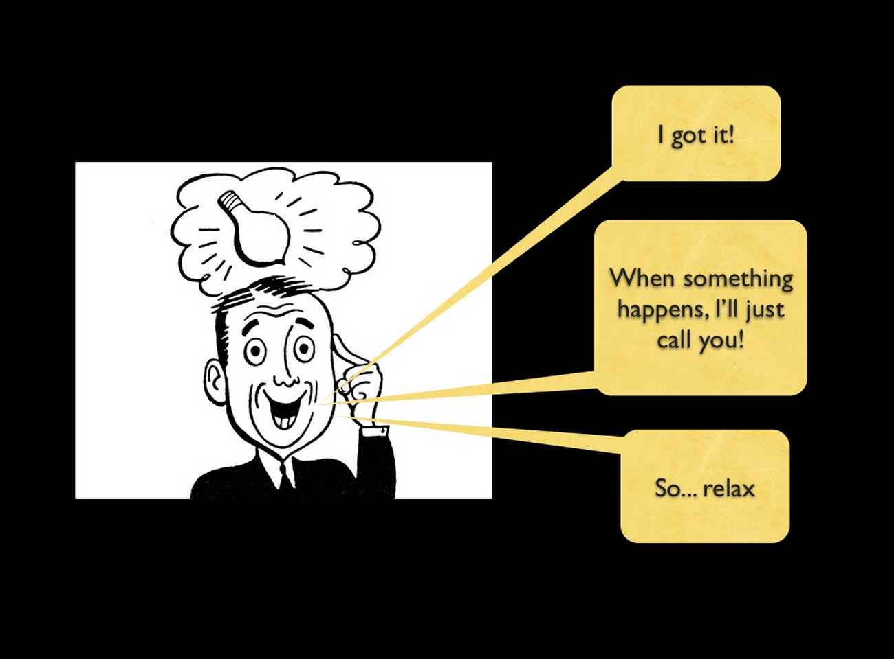
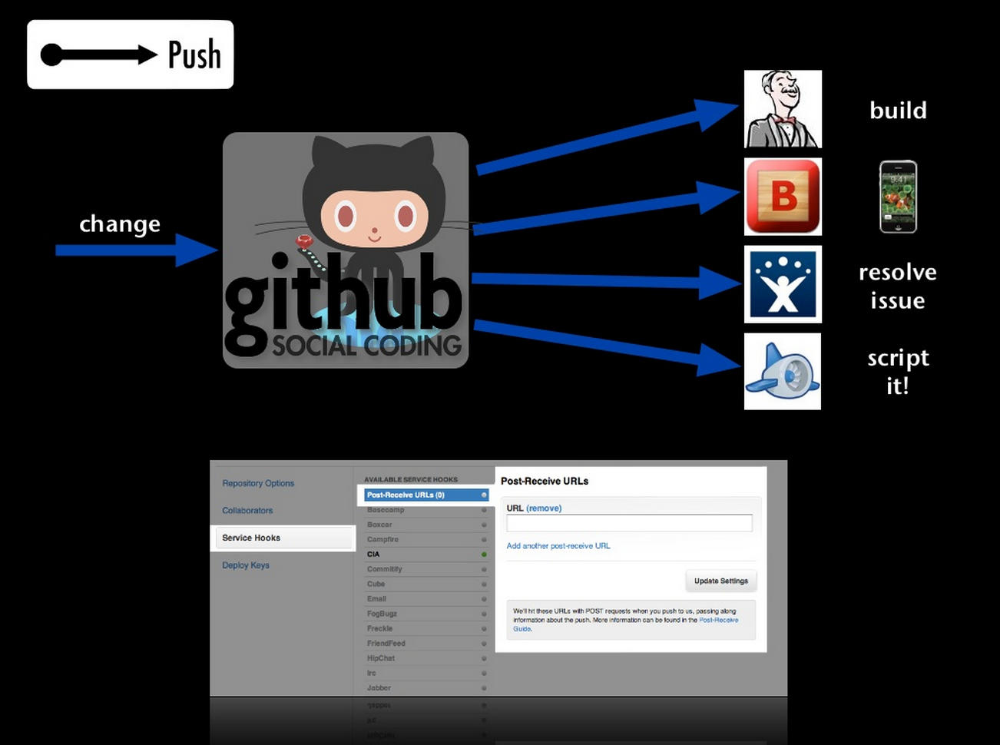

# You have Realtime Data. You just don't know it!

## Intro

If I were given $1 for every time I'd seen or heard phrases like "that real-time framework is awesome - now to find a use for it." I'd be seriously rich. So, you've heard of realtime frameworks, seen a chat demo and played multiplayer HTML5 Asteroids, but you don't think you have a use for that sort of functionality right now. *I bet you do*.

In this talk I'll cover common scenarios in your applications where you'll find that you do have realtime data. And once you've identified the data how you can start benefiting from it by understanding what's happening *right now* in your app and by using it to build awesome features for your customers.

## What is Realtime?

* Hard Realtime
* Soft Realtime

## Realtime Frameworks

## Finding a Use

> that real-time framework is awesome - now to find a use for it

## Where do you find Realtime data?

### The Evented Web

In 2011 [Mike Brevoort](https://twitter.com/mbrevoort) gave a few talks about [the Evented Web](http://www.slideshare.net/brevoortm/the-evented-web). He spoke about WebHooks, Comet WebSockets and fallbacks. But a couple of slides stood out in these presentations:

*Note: remember this was 2011 - before GIFs were cool again*

> When something happens, I'll just call you!

This is interesting for two reasons.

**When something happens** starts us thinking about the idea of *events*. **I'll just call you** is then an *action* that has been *triggered* following the event. It's also about the initiator of the event informing the interested parties about that event.

Mike goes on to show a concrete example of this:

As well as this slide showing interested parties - Jenkins, Boxcar, JIRA, GAE - it shows that **change** is the trigger. The arrows in this diagram also represent something - they represent some form *interaction*.

So, the point is that when **something happens** - when **change** or **interaction** occurs - you **trigger an event** about that change or interaction.

### Events

So, if you can identify the change and the events within your application you can identify where the realtime data is. And there are lots of places you'll commonly find events:

#### Where do events occur in your app?

As above, if you can identify where change and interactions takes place you can identify realtime data within your app.

#### Data Changes

Many of our applications are driven by data. Any change that takes place to that data represents an event. So, any CUD (Create, Update, Delete) operation represents a change. Even Read operations represent an event within your system.

**Image of chewing cow**

#### System Interactions

* System interactions
	* Incoming Email
	* WebHooks
	* Cron jobs
	* Logging: Errors, Info, Debug

#### User Interactions

* User events
	* Accessing pages and views
	* Interacting with the application
	
## You Have Realtime Data

* Changes & Interactions
* Data Changes
* System Interactions
* User Interactions

## How can you use this data?

## What's happening right now in your App

* Seeing patterns of usage and capitalising - it could be too late if you view the logs later
	* Errors and access logs
	* How the app is being used
		* Pages Views
		* Who's online
		* Popular pages
* Consume system logs
	* Statd
	* Graphite
	* Liberato
* Realtime website analytics
	* Advertising campaign not converting. Make changes or cancel.
	* Capitalize or bail

## Customers: Building Awesome Realtime Features

* App features
	* Who else is online
	* What's happening related to:
		1. Where the user is in the app
		2. The things they are interested in e.g. friends
	* Take the uses cases and provide examples e.g. notifications, data, presence, activity streams
* Realtime APIs

## How to do this?

* Categorise and publish the events you've discovered
	* Direct publishsing
	* Stick on a message queue
	* Add to a database, query and publish
* Build awesome stuff

## Conclusion

## Q&A

* What are you building - I'll try and tell you where the realtime data is and what you can do with it.